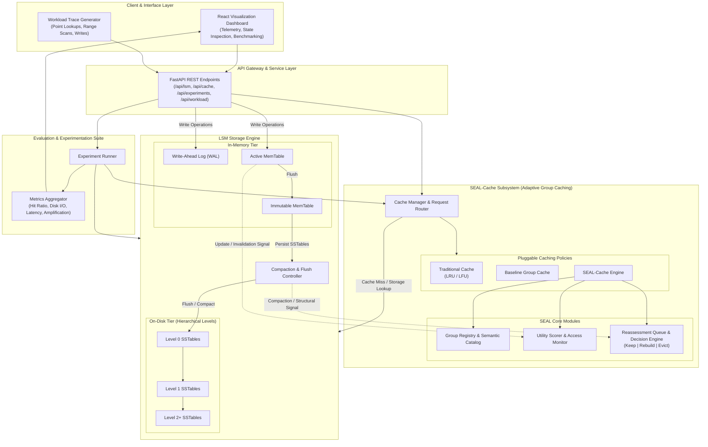

# SEAL-Cache

## Semantic Eviction and Adaptive Loading for Dynamic LSM-Tree Group Caching

SEAL-Cache is an experimental systems research project that investigates adaptive caching for dynamic Log-Structured Merge-tree (LSM) key-value storage engines.

LSM-based key-value stores provide high write throughput, but maintaining effective caching remains challenging under dynamic workloads. While traditional Group Caching groups logically related key-value data to accelerate access, frequent writes, MemTable flushes, and background compactions continuously reorganize the underlying SSTables, degrading the accuracy and utility of previously cached groups.

**SEAL-Cache** introduces an adaptive caching paradigm: instead of immediately evicting a cached group when its underlying storage structure updates, the system monitors access behavior, update intensity, and compaction signals to mark affected groups for dynamic reassessment—deciding whether to **Keep**, **Rebuild**, or **Evict**.

---

## System Architecture



### Architectural Components

- **Client & Interface Layer**: Includes the interactive React dashboard for live storage inspection and workload controls, alongside a synthetic and trace-based workload generator.
- **API Gateway**: FastAPI service routing commands across storage, cache, workload generation, and experiment controllers.
- **SEAL-Cache Subsystem**:
  - **Cache Manager**: Coordinates lookups, insertions, and dispatches across Traditional (LRU/LFU), Baseline Group, and SEAL-Cache policies.
  - **Group Registry**: Organizes keys into logically related groups based on query predicates or semantic tags.
  - **Utility Scorer**: Continuously updates utility weights based on hit frequency, access recency, and write penalty.
  - **Reassessment Queue**: Processes structural change notices from the LSM engine, triggering targeted decisions (`KEEP`, `REBUILD`, or `EVICT`) rather than immediate blind invalidation.
- **LSM Storage Engine**: Hierarchical LSM implementation featuring active/immutable MemTables, Write-Ahead Logging (WAL), on-disk leveled SSTables, and a Compaction & Flush controller.
- **Evaluation & Experimentation Suite**: Orchestrates reproducible benchmark experiments across policies and logs performance telemetry (cache hit ratio, disk read/write amplification, and request latency).

---

## Implementation Progress

### Completed So Far

- [x] **Project Skeleton & Directory Organization**: Structured backend modular packages (`api`, `cache`, `lsm`, `workload`, `experiments`) and frontend workspace.
- [x] **LSM Storage Engine Foundation**:
  - In-memory MemTable implementation with sorted key-value storage.
  - SSTable disk layout with index blocks and key ranges.
  - Leveled hierarchy structure with MemTable-to-L0 flush operations.
  - Basic level-to-level compaction triggers and key merging.
- [x] **Multi-Policy Caching Framework**:
  - Extensible cache abstraction supporting modular replacement algorithms.
  - Traditional baseline caching policies (LRU and LFU implementations).
  - Baseline static Group Cache implementation for bundled key retrievals.
- [x] **SEAL-Cache Core Mechanics**:
  - Semantic group metadata indexing and key-to-group mapping.
  - Dynamic utility scoring algorithm based on access frequency and write recency.
  - Reassessment queue model for evaluating degraded groups.
- [x] **Workload Generation & Benchmarking Base**:
  - Request synthesis engine supporting point reads (`GET`), insertions/updates (`PUT`), and range scans (`SCAN`).
  - Experiment execution harness collecting cache hits, misses, disk I/O, and latency statistics.
- [x] **Frontend Dashboard Architecture**:
  - React application setup for visualizing MemTable status, SSTable level distribution, and cache performance metrics.

---

## Upcoming Phases & Roadmap

### Phase 1: Advanced Semantic Profiling & Dynamic Rebuilding

- Implement selective in-cache group rebuilding to partially refresh modified groups instead of evicting them entirely.
- Introduce adaptive decay rates for group utility scores under bursty write workloads.
- Add support for semantic range predicates and dynamic group boundary auto-tuning.

### Phase 2: LSM Storage Hardening & Concurrency

- Integrate Bloom filters for fast negative lookups across SSTables.
- Optimize multi-way merge compactions with size-tiered and leveled compaction tuning.
- Introduce asynchronous thread pools for background compaction and non-blocking MemTable flushes.

### Phase 3: Comprehensive Workload Benchmarking & Evaluation

- Run exhaustive comparative evaluations comparing SEAL-Cache against Traditional LRU/LFU and static Group Cache under varying read/write ratios.
- Add export utilities for experiment results (CSV, JSON, and publication-ready charting data).

### Phase 4: Full Dashboard Visualization & Real-Time Telemetry

- Real-time animated visualization of LSM tree compactions, MemTable flushes, and SSTable promotions.
- Interactive inspection of cached groups, their constituent keys, and current lifecycle states (`VALID`, `REASSESS`, `EVICTED`).
- Live comparison graphs displaying hit ratios and disk I/O savings side by side.

---

## Repository Structure

```
├── backend/
│   ├── app/
│   │   ├── api/             # FastAPI route handlers and request models
│   │   ├── cache/           # Caching engine and policies (LRU, LFU, Group, SEAL)
│   │   │   └── policies/    # Specific eviction and reassessment strategies
│   │   ├── experiments/     # Benchmark runner and metrics collection
│   │   ├── lsm/             # LSM engine (MemTable, SSTable, Compaction)
│   │   └── workload/        # Workload trace generator and request definitions
│   ├── requirements.txt     # Python backend dependencies
│   └── run.py               # Backend entrypoint
├── frontend/
│   ├── src/                 # React components, dashboard views, and visualizers
│   ├── package.json         # Frontend dependencies and scripts
│   └── vite.config.js       # Vite build configuration
└── README.md
```

---

## How to Run

### Step 1: Start Backend

```bash
cd backend
python -m venv venv
venv\Scripts\activate       # On Linux/macOS: source venv/bin/activate
pip install -r requirements.txt
python run.py
```

- **Backend API**: `http://localhost:8000`
- **Swagger Documentation**: `http://localhost:8000/docs`

### Step 2: Start Frontend

```bash
cd frontend
npm install
npm run dev
```

- **Dashboard UI**: `http://localhost:5173`
