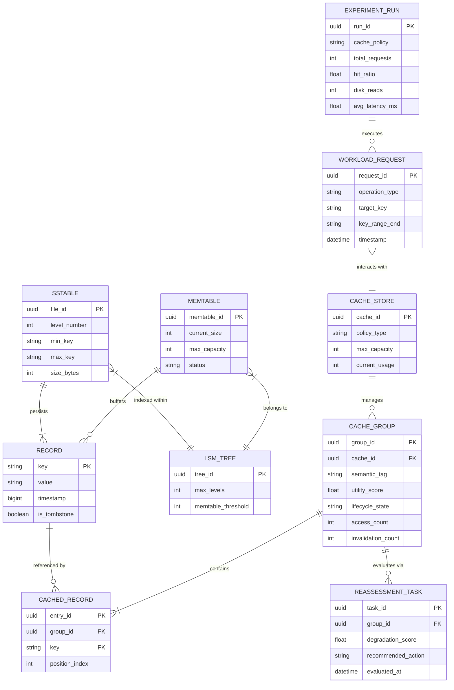

# SEAL-Cache Simulator - Milestone 1 (50% Milestone)

## Architecture Overview
This package contains the complete 50% milestone:
1. Backend: Leveled LSM-tree storage engine, multi-policy caching (LRU, LFU, SEAL-Core), workload trace generator, and experiment runner.
2. Frontend: Dedicated React dashboard visualizing the Memtable, SSTable levels, cache hit inspection, and benchmark execution.

## System Overview


---

## Entity Relationship (ER) Diagram

The following ER diagram illustrates the core domain entities across the LSM storage engine, the adaptive SEAL-Cache layer, and the workload evaluation framework:



### Entity Descriptions
- **RECORD**: Represents raw key-value entries with version timestamps and deletion tombstones.
- **MEMTABLE**: In-memory mutable write buffer before data flushes to persistent SSTable files.
- **SSTABLE**: Immutable on-disk sorted string table files organized into hierarchical levels.
- **LSM_TREE**: Orchestrates the storage engine, managing MemTables, level compaction, and lookups.
- **CACHE_STORE**: The caching subsystem supporting Traditional, Group, and SEAL-Cache eviction strategies.
- **CACHE_GROUP**: Logical groupings of related keys annotated with utility scores and dynamic lifecycle states (`VALID`, `REASSESS`, `EVICTED`).
- **CACHED_RECORD**: Association entity linking underlying records to their respective cached group.
- **REASSESSMENT_TASK**: Triggered when compaction or update activity invalidates group cohesion, evaluating whether to keep, rebuild, or evict.
- **WORKLOAD_REQUEST**: Read, write, or range-scan queries driving system execution.
- **EXPERIMENT_RUN**: Records evaluation benchmarks across cache policies (hit ratio, disk I/O, latency).

## How to Run

### Step 1: Start Backend
```bash
cd backend
python -m venv venv
venv\Scripts\activate
pip install -r requirements.txt
python run.py
```
Backend runs at: http://localhost:8000
Swagger Docs at: http://localhost:8000/docs

### Step 2: Start Frontend
```bash
cd frontend
npm install
npm run dev
```
Frontend runs at: http://localhost:5173
